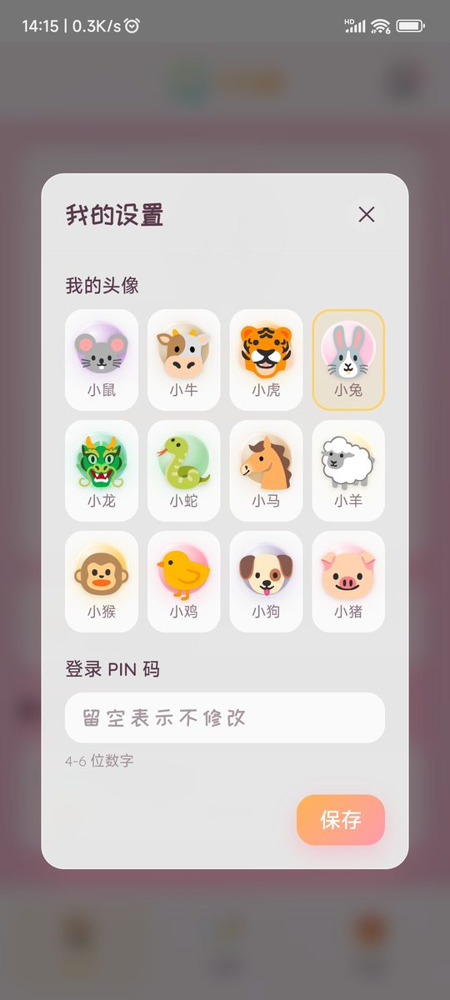
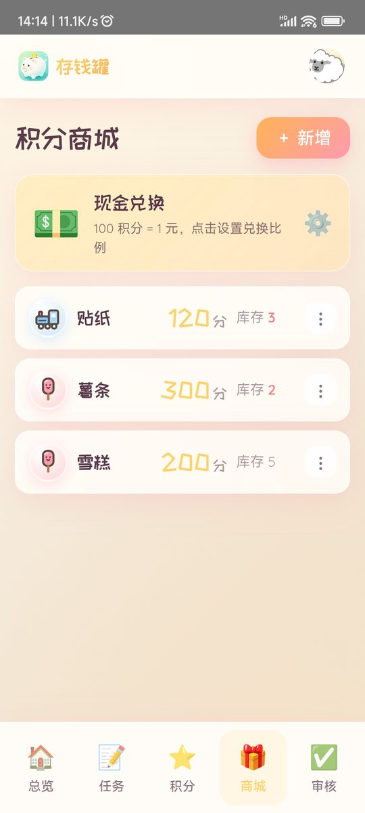
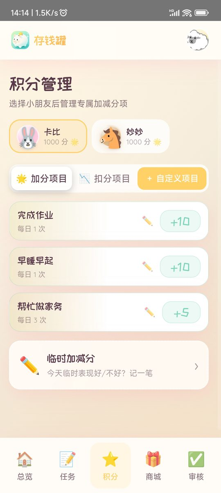
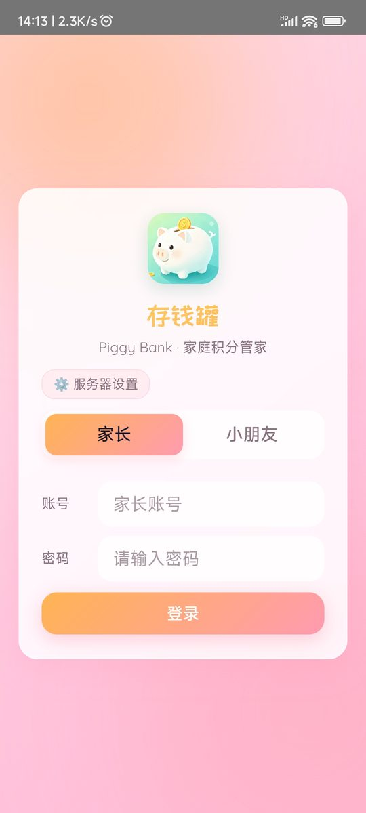

# 🐷 存钱罐 · Piggy Bank

> 一个面向家庭的自托管积分管理系统 —— 让孩子在完成任务、赚取积分、兑换奖励的过程中，学会规划与储蓄。

**怎么玩**：孩子完成日常任务，或家长发布的临时任务 → 获得积分 → 用积分在商店兑换商品或现金；
所有申请由家长审核把关。数据全部保存在本机（SQLite 单文件），**不上传任何云端**。

[功能特性](#功能特性) · [界面预览](#界面预览) · [快速开始](#快速开始docker-部署) · [常见问题](#常见问题) · [更新日志](#更新日志)

---

## 功能特性

### 👨‍👩‍👧 家长端
| 模块 | 说明 |
|---|---|
| **总览** | 查看所有孩子的积分、今日积分变化、待审核数量 |
| **积分** | 设置日常加分/扣分项目（可限制每日次数），一键为孩子加减分 |
| **任务** | 发布临时任务（含分类、积分奖励、截止时间） |
| **审核** | 审批孩子提交的任务完成申请、商品/现金兑换申请 |
| **商店** | 管理可兑换的商品（名称、所需积分、库存） |
| **记录** | 查看全部积分流水明细与操作人 |
| **成长** | 记录身高体重，成长曲线对照中国儿童生长标准看百分位；支持多孩子按年龄对齐对比 |

### 🧒 孩子端
| 模块 | 说明 |
|---|---|
| **首页** | 查看自己的积分余额、生肖头像、等级进度 |
| **任务** | 领取任务、提交完成，等待家长审核 |
| **商店** | 用积分兑换商品，或申请兑换现金 |

### ✨ 其他
- 家长用 **账号 + 密码** 登录；孩子用 **账号 + PIN 码** 登录（无需记密码）
- 内置 **12 生肖头像**
- 响应式设计，手机 / 平板 / 电脑均可使用
- 支持积分兑换比例自定义（如 10 积分 = 1 元）
- 支持 WebSocket 实时更新（家长端审核数即时刷新）
- 提供 **飞牛 fnOS fpk 应用包**：应用中心手动安装，数据由系统托管、升级不丢
- 提供 **Android 客户端**（Capacitor 打包），手机原生体验

---

## 界面预览

**孩子端**

<p align="center">
  
  &nbsp;&nbsp;
  
</p>

**更多界面**

<p align="center">
  
  &nbsp;&nbsp;
  
  <br><br>
  
  &nbsp;&nbsp;
  
</p>

---

## 技术栈

| 层 | 技术 |
|---|---|
| 前端 | Vue 3 + Vite + Pinia + Vue Router |
| 后端 | Fastify + better-sqlite3 |
| 数据库 | SQLite（单文件，零配置） |
| 部署 | Docker / Docker Compose |

---

## 快速开始（Docker 部署）

### 方式一：Docker Compose（推荐）

```bash
# 1. 进入项目目录（含 docker-compose.yml 的那一层）
cd piggy-bank-server

# 2. 构建并启动
docker compose up -d --build

# 3. 查看状态
docker ps
```

启动后浏览器访问：

```
http://<你的NAS或服务器IP>:3000
```

### 方式二：Docker 命令

```bash
# 构建镜像
docker build -t piggy-bank:latest .

# 运行容器
docker run -d \
  --name piggy-bank \
  --restart unless-stopped \
  -p 3000:3000 \
  -v $(pwd)/data:/app/data \
  -e ADMIN_USERNAME=admin \
  -e ADMIN_PASSWORD=你的强密码 \
  -e JWT_SECRET=你的随机密钥 \
  piggy-bank:latest
```

### 方式三：本地开发

```bash
# 安装依赖
npm install

# 同时启动前后端（开发模式）
npm run dev
# 前端: http://localhost:5173
# 后端: http://localhost:3000
```

---

## 首次登录

系统首次启动时会自动创建管理员账号：

| 项目 | 默认值 |
|---|---|
| 用户名 | `admin` |
| 密码 | `admin123` |

> ⚠️ **请登录后立即修改密码**（家长端 → 设置）。
> 默认密码是公开的，不改会有安全风险。

登录后：
1. 在 **家长端** 添加孩子账号，设置孩子的 **PIN 码**
2. 在 **积分** 里检查/调整默认的加分、扣分项目
3. 在 **商店** 里添加可兑换的商品
4. 在 **任务** 里发布任务
5. 孩子即可用自己的账号 + PIN 登录使用

---

## 环境变量

| 变量 | 默认值 | 说明 |
|---|---|---|
| `PORT` | `3000` | 服务监听端口 |
| `DATA_DIR` | `/app/data` | 数据目录（SQLite 数据库存放位置） |
| `ADMIN_USERNAME` | `admin` | 首次初始化时创建的管理员用户名 |
| `ADMIN_PASSWORD` | `admin123` | 首次初始化时创建的管理员密码 |
| `JWT_SECRET` | `please-change-this-secret` | 登录令牌签名密钥，**务必修改** |

> ℹ️ `ADMIN_USERNAME` / `ADMIN_PASSWORD` **仅在数据库为空（首次启动）时生效**。
> 如果数据库中已存在家长账号，这两个变量不会覆盖已有账号。

### 修改配置

推荐用 `.env` 文件（`docker-compose.yml` 同目录）：

```dotenv
ADMIN_USERNAME=admin
ADMIN_PASSWORD=改成你的强密码
JWT_SECRET=改成一串随机字符串
```

然后重新执行 `docker compose up -d`。

---

## 数据存储与备份

所有数据保存在 `data/` 目录下的 SQLite 数据库：

```
data/
├── money-jar.db         # 主数据库
├── money-jar.db-wal     # 预写日志
└── money-jar.db-shm     # 共享内存
```

**备份**：直接复制整个 `data/` 目录即可（建议连同 `-wal`、`-shm` 一起复制）。

**恢复**：把备份的 `data/` 目录放回原位，重启容器。

> ⚠️ 不要单独删除 `data/` 目录，否则所有账号和积分记录都会丢失。

---

## 项目结构

```
piggy-bank-server/
├── Dockerfile
├── docker-compose.yml
├── package.json                  # 工作区根配置
├── server/                       # 后端
│   ├── package.json
│   ├── tsconfig.json
│   └── src/
│       ├── index.ts              # 入口
│       ├── config.ts             # 配置
│       ├── auth.ts               # 鉴权（JWT + bcrypt）
│       ├── middleware.ts
│       ├── ws.ts                 # WebSocket
│       ├── db/
│       │   ├── index.ts          # 数据库初始化与迁移
│       │   └── schema.sql        # 表结构
│       └── routes/               # 接口路由
└── web/                          # 前端
    ├── package.json
    ├── vite.config.ts
    ├── tsconfig.json
    ├── index.html
    ├── dist/                     # 预构建产物（Docker 部署直接使用）
    └── src/
        ├── main.ts
        ├── App.vue
        ├── api/                  # 接口封装
        ├── components/           # 通用组件
        ├── router/               # 路由
        ├── stores/               # Pinia 状态
        ├── styles/
        ├── utils/
        └── views/
            ├── Login.vue
            ├── parent/           # 家长端页面
            └── child/            # 孩子端页面
```

---

## 常用命令

```bash
# 启动 / 停止 / 重启
docker compose up -d
docker compose stop
docker compose restart

# 重新构建（代码更新后）
docker compose up -d --build

# 停止并删除容器（数据保留）
docker compose down

# 查看日志
docker compose logs -f
```

---

## 常见问题

### 1. 构建失败，提示找不到文件

确认在**包含 `docker-compose.yml` 的目录**下执行命令，且该目录下有 `Dockerfile`、`server/`、`web/`。

> 仓库只含源码、不含构建产物 `web/dist/`，自行构建镜像前先在根目录执行一次
> `npm install` 和 `npm run build`（生成 `web/dist` 与 `server/dist`）再 `docker build`。

### 2. 端口被占用

修改 `docker-compose.yml`：

```yaml
ports:
  - "3100:3000"      # 把左边的 3000 改成其它端口
```

保存后执行 `docker compose up -d --build`，再访问新端口。

### 3. 构建时网络超时（国内环境）

`Dockerfile` 已内置国内镜像源配置（`registry.npmmirror.com`），正常情况下无需处理。
若仍失败，通常是网络波动，重新执行一次构建即可。

### 4. 忘记密码

删除 `data/money-jar.db` 会重置所有数据（**慎用**）。
`ADMIN_USERNAME` / `ADMIN_PASSWORD` 环境变量只在数据库为空时生效。

### 5. 能在外网访问吗？

默认只监听局域网。若要外网访问，建议使用 **内网穿透** 或 **反向代理 + HTTPS**，
**不要**直接把 3000 端口暴露到公网。

---

## 安全建议

1. **务必修改默认密码** `admin123`
2. **务必修改 `JWT_SECRET`**，使用随机字符串
3. 孩子的 PIN 码不要设置得过于简单
4. 定期备份 `data/` 目录
5. 不要将服务直接暴露到公网

---

## 更新日志

完整变更记录见 [CHANGELOG.md](./CHANGELOG.md)。当前版本 **v1.3.3**（2026-09-17）：

- **成长记录**：新增多孩子成长曲线对比（按年龄对齐、固定色序）；手机端选择器瘦身
- **Android**：系统栏改实色暖白，修复沉浸式导致的窗口动画掉帧
- **UI 全面改造**（B0–B7）：设计 token 化、文字对比度达标、字体本地自托管、弹窗行为统一、可达性支持
- **新增飞牛 fnOS fpk 打包**：Docker 镜像预构建 + 应用数据托管，升级覆盖安装不丢数据

---

## 许可证

本项目采用 **MIT License** 开源。

```
Copyright (c) 2026 基耶杰
```

这意味着你可以自由地使用、修改、分发本项目（包括商业用途），
只需保留原始的版权声明和许可证文本。

详见 [LICENSE](./LICENSE) 文件。

---

## 致谢

感谢所有为家庭积分管理提供灵感与建议的人。
